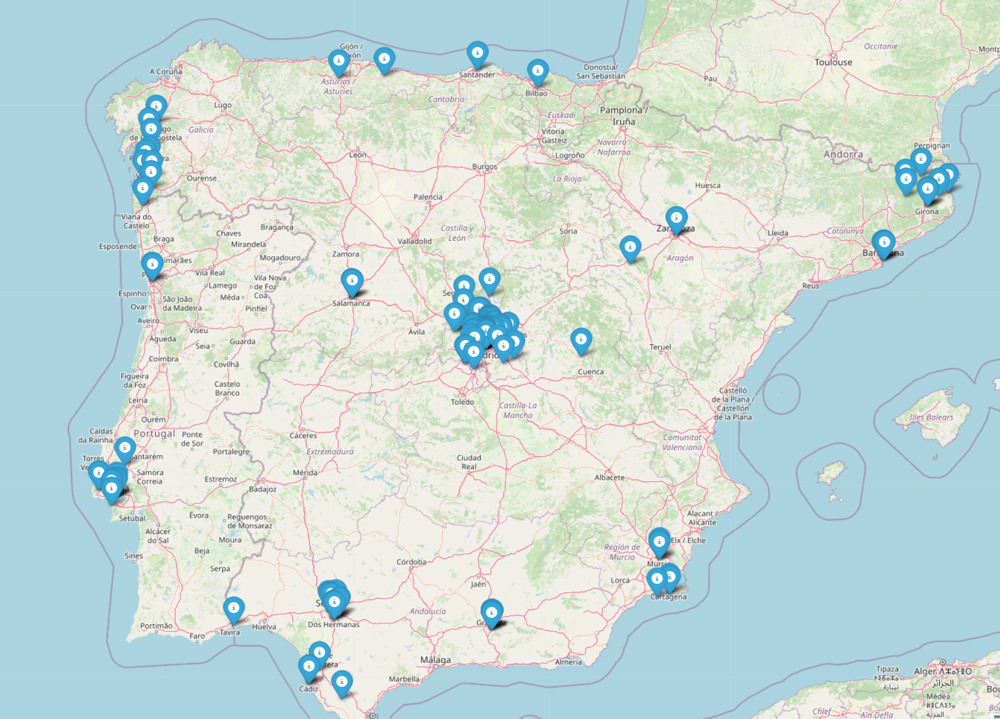

# 📅🗺️ Google Calendar Event Mapper

This project connects to your Google Calendar, fetches events from multiple calendars, extracts their locations, geocodes those locations (with OpenCage), and plots them on an interactive map using Folium.

## Features

- Connects to Google Calendar using OAuth2.
- Fetches all events from selected calendars since 2010.
- Extracts and deduplicates locations.
- Uses OpenCage (or optionally geopy) to get latitude and longitude.
- Stores geocoded locations to avoid redundant API calls.
- Allows for a blacklist of ignored locations.
- Filters out incomplete or suspicious location strings.
- Plots all valid locations on a map (`location_map.html`).

## Folder Structure

```
.
├── bbdd/
│   ├── locations.csv              # Cached geocoded locations
│   └── blacklist_locations.csv    # Locations to ignore
├── credentials/
│   ├── .gitkeep
│   ├── google_calendar_credentials.json
│   ├── google_calendar_token.json
│   └── opencage.key
├── location_map.html              # Generated map
├── main.py                        # Main script
└── README.md
```

## Requirements

Install dependencies with Poetry:

```bash
poetry install
```

## Setup

1. Create a Google Cloud project and enable the Calendar API.
2. Place your `google_calendar_credentials.json` in the `credentials/` folder.
3. Get an API key from [OpenCage](https://opencagedata.com/api) and save it to `credentials/opencage.key`.
4. Create empty CSVs if they don't exist:
   - `bbdd/locations.csv` with columns: `location,lat,lon`
   - `bbdd/blacklist_locations.csv` with column: `location`

## Usage

```bash
make main
```

It will:
- Fetch events
- Geocode unknown valid locations
- Update the `locations.csv` database
- Plot a map with all known locations

## Map Output



## Notes

- Only locations that contain commas or match IATA airport codes (e.g., `Sevilla SVQ`) are considered valid.
- Geocoding is skipped for blacklisted locations or those already cached.
- Confidence threshold (OpenCage): ≥ 7

## License

MIT
